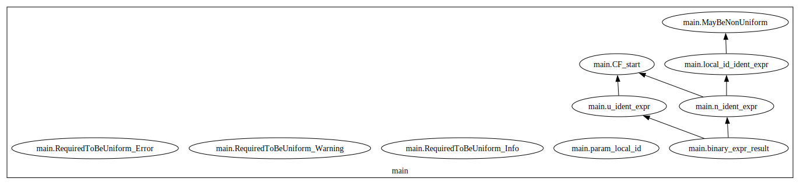
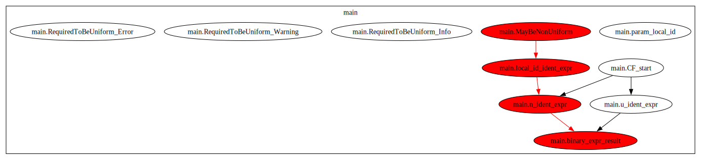
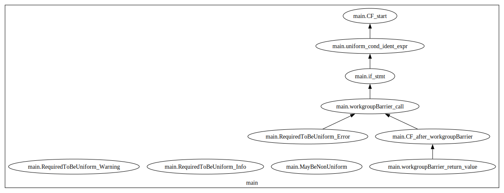
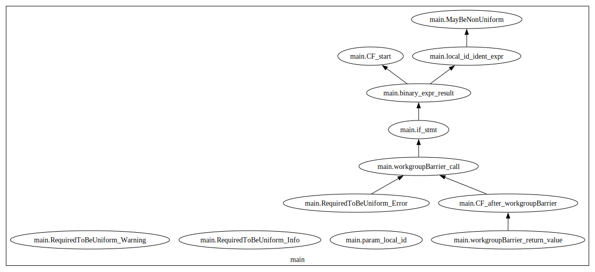

# Tint: Uniformity Analysis

This document provides a high-level overview of Uniformity Analysis in Tint. It is intended for developers who need to understand or modify the uniformity analysis pass at: [src/tint/lang/wgsl/resolver/uniformity.cc](../../src/tint/lang/wgsl/resolver/uniformity.cc).

## What is Uniformity?

In GPU programming, "uniformity" refers to whether a value is guaranteed to be the same across all threads executed in a group, like a workgroup, subgroup or quad. There are two concepts necessary to understand the analysis of uniformity of a WebGPU program: uniform values and uniform control flow.

### Values

**Uniform Value**: For a given value in a GPU program, if every thread in the workgroup sees the same value, that value is considered **uniform**. Examples include static constants or values from a `uniform` buffer.

**Non-Uniform Value**: If different threads may see different values, that value is considered **non-uniform**. Examples include `@builtin(local_invocation_id)`, a `textureLoad()` from a non-uniform index, or values from a `read_write` storage buffer.

### Control Flow

**Uniform Control Flow**: If every thread in the workgroup is guaranteed to be executing the same statement at the same time, the control flow is **uniform**.

**Non-Uniform Control Flow**: If different threads may be executing different statements, the control flow is **non-uniform**. For example, inside an `if` block where the condition was based on a non-uniform value like the thread id. Some GPU operations, like barriers, must only be executed in uniform control flow.

## What is Uniformity Analysis?

**Uniformity Analysis** is a static compiler pass that proves that certain operations are performed in uniform control flow. If it cannot prove that uniformity is maintained everywhere that uniformity is required, it will result in a compilation error. By necessity, it is a conservative compile-time analysis, meaning it will produce false negatives by rejecting WGSL that would actually be uniform at runtime, but it errs on the side of caution to ensure that all accepted shaders are reasonably guaranteed to be safe and correct.

### Why do we need it?

WebGPU requires uniformity analysis for two main reasons:

1. **Correctness**: Operations like `textureSample()` require the GPU to calculate the differences between neighboring pixels in a quad. If the threads in a quad diverge (i.e., some enter an `if`, others don't), the derivatives become undefined, leading to visual artifacts. Requiring `textureSample()` to be called in uniform control flow helps graphics developers write functionally correct shaders.

2. **Safety**: Synchronization primitives like `workgroupBarrier()` require all threads in the workgroup to reach the barrier together. If the barrier is inside a non-uniform `if` block, some threads might never reach it. In traditional GPU programming models, this would typically result in undefined behavior, and might lead to a GPU hang. WebGPU is designed to execute untrusted web content, so additional hardening against these negative outcomes is strictly necessary because that execution happens in a shared GPU context with less process isolation than other tightly sandboxed web APIs typically have.

## High-Level Implementation

### Graph Construction

Tint implements uniformity analysis by building a **Directed Dependency Graph**.

The analysis uses two main types of graph nodes:

- **Value Nodes**: Represent the uniformity of an expression or variable.
- **Control Flow (CF) Nodes**: Represent the uniformity of the current execution path.

An edge in the uniformity dependency graph from `A -> B` signifies that the uniformity of node `A` is dependent on the uniformity of node `B`. This means if `B` is non-uniform, then `A` must also be considered non-uniform. The uniformity analysis pass builds a graph of these nodes and edges, and when non-uniform values are encountered, it can be determined which parts of control flow they affect.

#### Example

```wgsl
@compute @workgroup_size(8)
fn main(@builtin(local_invocation_id) local_id : vec3u) {
  let u = 1u;
  let n = local_id.x;
  let result = u + n;
}
```

In the example above, `local_id` is a non-uniform value, represented by the edge in the graph below from `main.local_id_ident_expr -> main.MayBeNonUniform`. The `result` is a binary expression dependent on a uniform value (`u`) and a non-uniform value (`n`). This is represented by the edges from `main.binary_expr_result -> main.u_ident_expr` and `main.binary_expr_result -> main.n_ident_expr`.

**Dependency Graph (Tint)**:


You can think of non-uniformity like an "infection". If you reversed the direction of all edges in the graph, it would represent the pathways through which the non-uniformity infection spreads. For illustration purposes, the arrows are reversed in the graph below and infected nodes are highlighted in red, showing how the `MayBeNonUniform` infection spreads from `local_id`, to `n`, to `binary_expr_result`.

**Infection Flow**:


There's nothing wrong with this example shader though, it compiles successfully in Tint. Shaders can have non-uniform values and non-uniform control flow, as long as they're used in a valid way conformant with the WGSL spec.

### Validation

With such a graph built, Tint can now assess the validity of operations like `textureSample` or `workgroupBarrier`. When a function that requires uniform control flow is encountered in the AST, the analyzer checks the current **Control Flow Node**. If that node can be traced back to a non-uniform source, then the analysis cannot guarantee that the operation was called in uniform control flow and validation fails.

#### Example: Valid Control Flow (Uniform)

In this example, the `if` condition is a constant, which is uniform. Every thread in the workgroup is guaranteed to enter the `if` block and reach the barrier together.

```wgsl
@compute @workgroup_size(64)
fn main() {
  const uniform_cond = true;
  if (uniform_cond) {
    workgroupBarrier(); // Valid: Uniform control flow
  }
}
```

This shader passes validation and compiles successfully in Tint. In the graph below, note that the `main.RequiredToBeUniform_Error` node cannot reach any `MayBeNonUniform` values.



#### Example: Invalid Control Flow (Non-Uniform)

In this example, the `if` condition depends on `local_id.x`, which is non-uniform. Threads will diverge, meaning some will reach the barrier while others do not. This is a validation error.

```wgsl
@compute @workgroup_size(64)
fn main(@builtin(local_invocation_id) local_id : vec3u) {
  if (local_id.x > 0u) {
    workgroupBarrier(); // Error: Divergent control flow
  }
}
```

**Tint Compiler Output:**

```text
test.wgsl:4:5 error: 'workgroupBarrier' must only be called from uniform control flow
    workgroupBarrier();
    ^^^^^^^^^^^^^^^^

test.wgsl:3:3 note: control flow depends on possibly non-uniform value
  if (local_id.x > 0u) {
  ^^

test.wgsl:3:7 note: builtin 'local_id' may be non-uniform
  if (local_id.x > 0u) {
      ^^^^^^^^
```

In the graph below, note that the `main.RequiredToBeUniform_Error` node **can** reach `main.MayBeNonUniform`.



## How to Generate Diagrams

Tint has a built-in feature to dump the dependency graph as a Graphviz (DOT) file, which was used to generate the example diagrams in this doc.

To generate these diagrams yourself to help understand the analysis, follow these steps:

1.  Download and install Graphviz: [https://graphviz.org/download/](https://graphviz.org/download/)
2.  Enable the dump flag in [src/tint/lang/wgsl/resolver/uniformity.cc](../../src/tint/lang/wgsl/resolver/uniformity.cc), by changing `#define TINT_DUMP_UNIFORMITY_GRAPH 0` to `1`.
3.  Rebuild Tint.
4.  Since this dumps the DOT file contents to stdout, you should be able to redirect it to a file with the following command:
    ```bash
    ./path/to/tint -o /dev/null shader.wgsl > graph.dot
    ```
5.  Render the image:
    ```bash
    dot -Tsvg graph.dot -o graph.svg
    ```

## Further Reading

The official WGSL specification contains all uniformity rules: [§15.2. Uniformity](https://www.w3.org/TR/WGSL/#uniformity).
