[](https://opensource.org/license/GPL-3.0)

* [About](#about)
* [License](#license)
* [Cherries](#cherries)
* [Installers](#installers)
* [Building](#building)
  * [On what platforms better use `Conan` to build `markdown-tools`?](#on-what-platforms-better-use-conan-to-build-markdown-tools)
* [Known issues](#known-issues)

> [!CAUTION]
>
> In editor and converter is implemented support of RTL languages. But I don't know any of such
> languages. I need testers to check if I implemented everything right. Thank you.

# About

This is a set of applications to work with `Markdown`, including editor, `HTML`
preview viewer, converter to `PDF`.


| 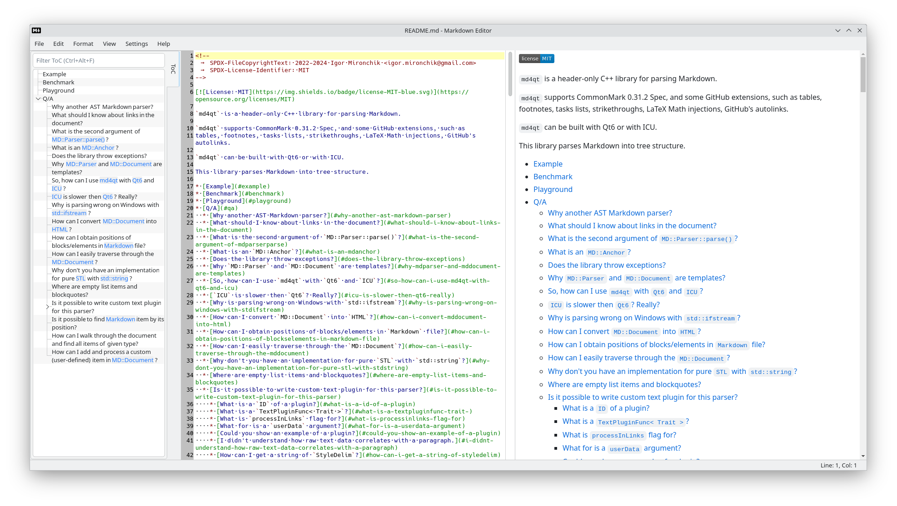 | 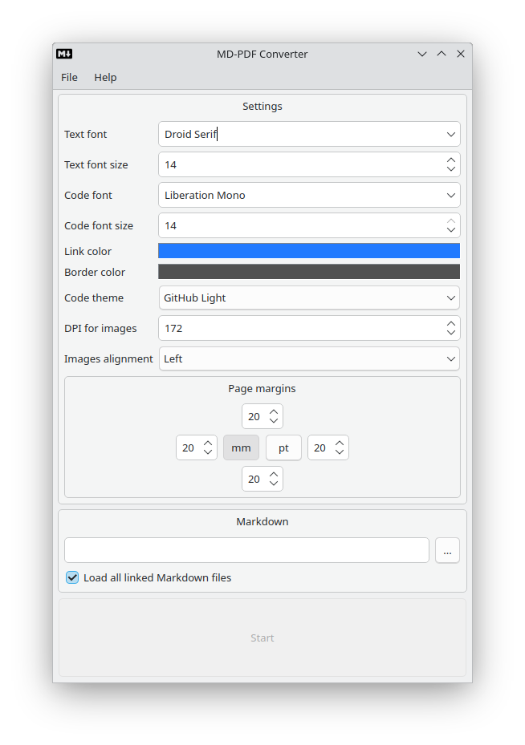 | 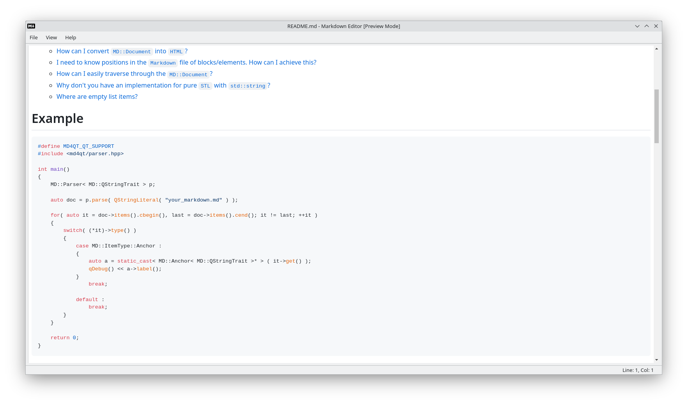 |
| --- | --- | --- |

# License

```
/*
    SPDX-FileCopyrightText: 2024 Igor Mironchik <igor.mironchik@gmail.com>
    SPDX-License-Identifier: GPL-3.0-or-later
*/
```

# Cherries

| Description | Screenshots |
|---|---|
| You can scroll Web preview to corresponding line from context menu in left side panel with ToC or from context menu of line number area | 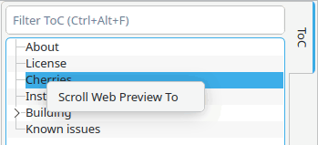 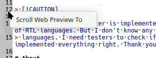 |
| You can scroll editor to corresponding heading by clicking item in left side panel with ToC | |
| You can load all linked Markdown files recursively and see a full Web preview of all of them at place | 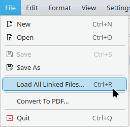 |
| You can choose working directory for the current Markdown document to process images and recursive links from that directory | 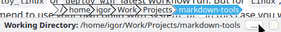 |
| This editor and converter can handle RTL and LTR languages | |
| You can setup and opt in additional style plugins for Markdown processing, like subscript, superscript, marking of text. This feature implemented both in editor and converter to PDF | 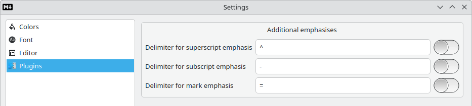 |
| You can generate GitHub flavoured ToC in Markdown in one click from menu | 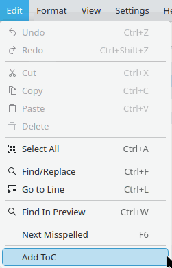 |
| Spell checking can be configured to handle more than one language in the Markdown document |  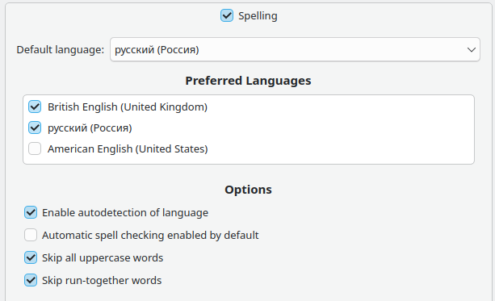 |
| You can find a text both in editor and in Web preview | 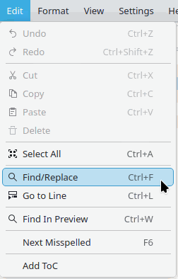 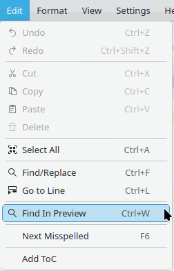 |
| You can use this editor like Web browser only for Markdown documents (preview mode) | |
| Maybe the author did forget something? Thanks for using. Enjoy | |

# Installers

You can get installers for `Windows` at
[actions page](https://github.com/igormironchik/markdown-tools/actions). Just check
for artifact at `deploy_win` latest workflow run.

For `Linux`, especially for `KDE`, I'd recommend to use your own build with system's
`Qt`, in this case you won't have issues with platform integration in `KDE`.

For `openSUSE Tumbleweed` I have a repository https://download.opensuse.org/repositories/home:/imironchik/my/
where you can get a `markdown-tools` package.

# Building

To build these applications first of all install dependencies:

 * `openssl`
 * `freetype`
 * `libjpeg`
 * `libpng`
 * `zlib`
 * `libxml2`
 * `fontconfig`
 * `extra-cmake-modules`
 * `kf6-syntax-highlighting`
 * `kf6-sonnet`
 * `Qt >= 6.7`
 * `tinyxml2`

With these dependencies installed just open `CMakeLists.txt` in `QtCreator`
(or use `CMake` from command line) and run build.

You can use `Conan` to install some dependencies.

`Fontconfig` should be installed in system, as using `Fontconfig` from `Conan` leads to ugly UI.

One more thing - don't use `jom`.

On `KDE` I suggest to use system's `Qt` libraries, as in this case applications will use
`KDE`'s Platform Plugin, that makes better integration with system.

## On what platforms better use `Conan` to build `markdown-tools`?

I don't suggest to use `Conan` on MacOS, there will be conflicts with `brew` and system libraries,
as I suggest to use `Fontconfig` from system. There will be problems. Just use `brew` on MacOS to
install dependencies.

On Windows `Conan` is a fresh wind to build this project.

On Linux you can use what you want, that is why this is my favourite OS.

# Known issues

* Don't use `HTML` attribute `class` in `HTML` tags, it can lead to wrongly rendered content.
`GitHub` do a magic in this case, it just deletes `class` attribute, but this editor places
`HTML` tags as they present.

* Strange behaviour of font combo box in fonts dialogue on check in/out check box to constraint
fonts to monospaced due to [QTBUG-112145](https://bugreports.qt.io/browse/QTBUG-112145)

* I do not render HTML tags in PDF.

* I don't support languages that don't separate words
with spaces in converter to `PDF`.

* SVG in PDF renders as raster image with support of Rust `resvg` library.
