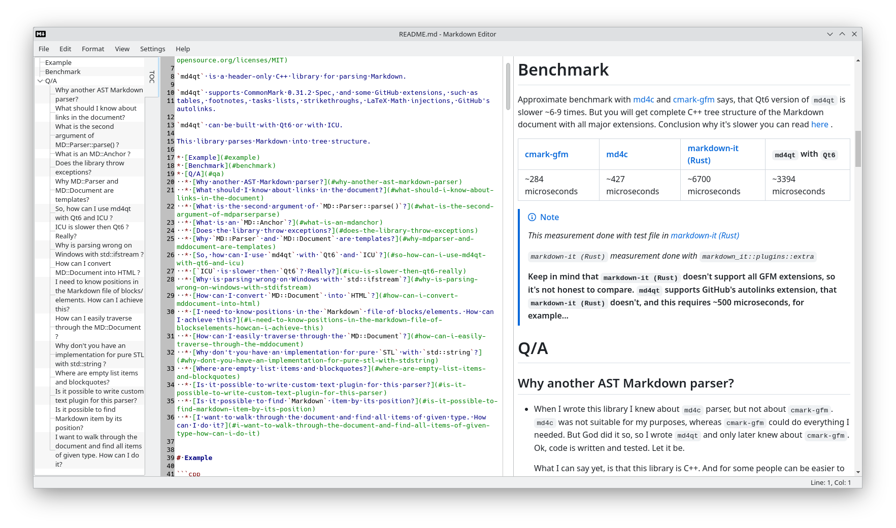
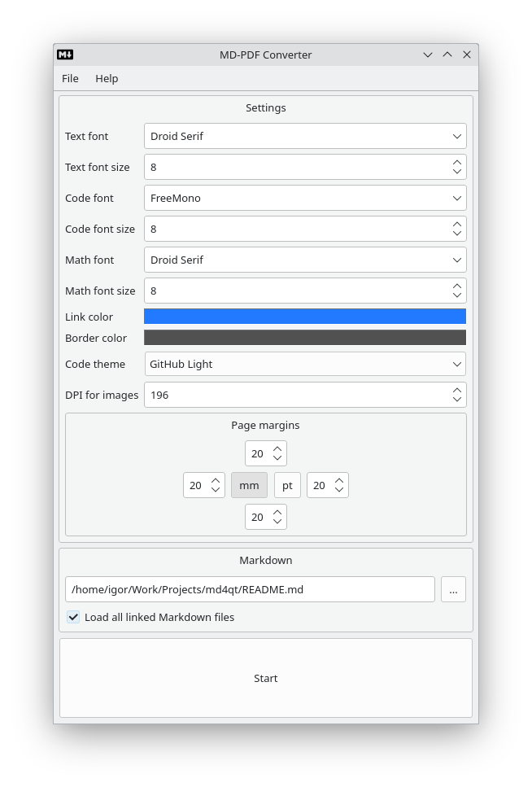
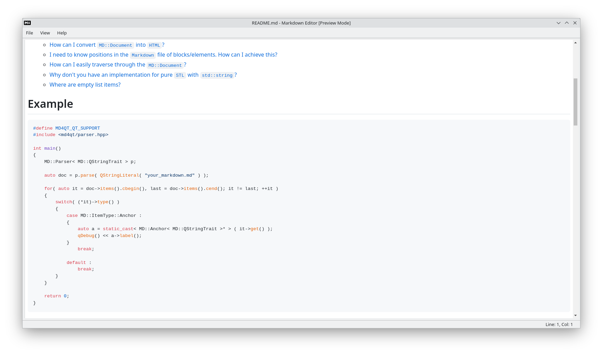

* [About](#about)
* [Building](#building)
  * [On what platforms better use `Conan` to build `markdown-tools`?](#on-what-platforms-better-use-conan-to-build-markdown-tools)
* [Known issues](#known-issues)

# About

This is a set of applications to work with `Markdown`, including editor, `HTML`
preview viewer, converter to `PDF`.

|  |  |  |
| --- | --- | --- |

# Building

To build these applications first of all install dependencies:

 * `openssl`
 * `freetype`
 * `libjpeg`
 * `libpng`
 * `zlib`
 * `libxml2`
 * `fontconfig`
 * `extra-cmake-modules`
 * `kf6-syntax-highlighting`
 * `Qt6`

With these dependencies installed just open `CMakeLists.txt` in `QtCreator`
(or use `CMake` from command line) and run build.

You can use `Conan` to install some dependencies.

`Fontconfig` should be installed in system, as using `Fontconfig` from `Conan` leads to ugly UI.

One more thing - don't use `jom`.

## On what platforms better use `Conan` to build `markdown-tools`?

I don't suggest to use `Conan` on MacOS, there will be conflicts with `brew` and system libraries,
as I suggest to use `Fontconfig` from system. There will be problems. Just use `brew` on MacOS to
install dependencies.

On Windows `Conan` is a fresh wind to build this project.

On Linux you can use what you want, that is why this is my favorite OS.

# Known issues

* Generated TOC may not work on `GitHub` if heading has text separated with two or more spaces.
I will generate label like text is separated with one space, i.e. label will look like: `text-text`,
where `-` replaces space, whereas `GitHub` will do `text--text`, i.e. two `-` for two spaces.
To keep heading's auto labels work just don't use redundant spaces in headings, and TOC will
work both in this editor and on `GitHub`.

* Don't use `HTML` attribute `class` in `HTML` tags, it can lead to wrongly rendered content.
`GitHub` do a magick in this case, it just deletes `class` attribute, but this editor places
`HTML` tags as they present.

* Links hovering may not change cursor shape due to [QTBUG-111927](https://bugreports.qt.io/browse/QTBUG-111927)

* Strange behaviour of font combo box in fonts dialog on check in/out check box to constraint
fonts to monospaced due to [QTBUG-112145](https://bugreports.qt.io/browse/QTBUG-112145)

* I do not render HTML tags in Markdown.

* Some LaTeX Math expressions can be wrongly rendered. I use very good
library `JKQtPlotter` to render LaTeX Math, and not everything is
implemented there. But most common math things are done.

* I don't support right-to-left languages and languages that don't separate words
with spaces. I don't know theirs rules to adapt algorithms[^1].

* `LaTeX` math expressions can be rendered a little differently on different platforms
due to [QTBUG-104790](https://bugreports.qt.io/browse/QTBUG-104790), that is why I don't
have auto tests for them.
 
[^1]: If you are one from these groups of people - you are welcome to make PRs to adapt
 this application to your language.