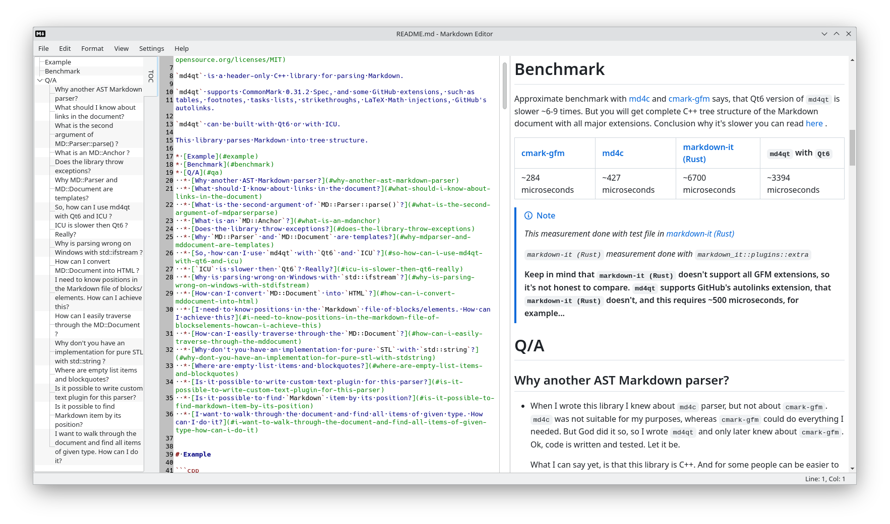
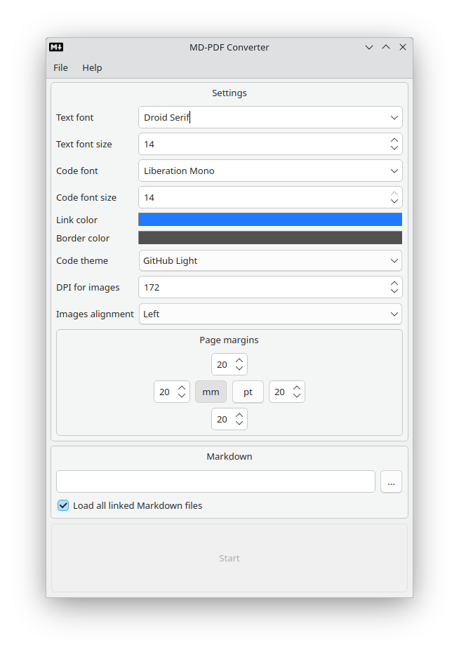
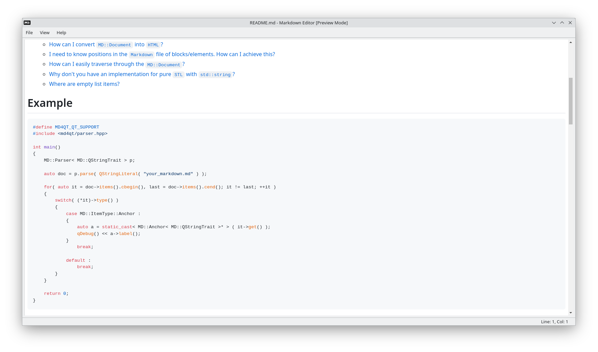

* [About](#about)
* [License](#license)
* [Cherries](#cherries)
* [Installers](#installers)
* [Building](#building)
  * [On what platforms better use `Conan` to build `markdown-tools`?](#on-what-platforms-better-use-conan-to-build-markdown-tools)
  * [Building for Windows](#building-for-windows)
    * [To build full installer for Windows you need](#to-build-full-installer-for-windows-you-need)
* [Known issues](#known-issues)
* [Translating](#translating)


# About

This is a set of applications to work with `Markdown`, including editor, `HTML`
preview viewer, converter to `PDF`.


|  |  |  |
| --- | --- | --- |

# License

```
/*
    SPDX-FileCopyrightText: 2026 Igor Mironchik <igor.mironchik@gmail.com>
    SPDX-License-Identifier: GPL-3.0-or-later
*/
```

# Cherries

You can look at a presentation [here](https://igormironchik.github.io/markdown-tools/).

# Installers

For `Linux`, especially for `KDE`, I'd recommend to use your own build with system's
`Qt`, in this case you won't have issues with platform integration in `KDE`.

Look at the release page for the installer for some Linux and Windows distributions.

# Building

To build these applications first of all install dependencies:

 * `zlib`
 * `extra-cmake-modules`
 * `kf6-syntax-highlighting`
 * `kf6-sonnet`
 * `kf6-kwidgetsaddons`
 * `Qt >= 6.7`
 * `fontconfig` for Linux

With these dependencies installed just open `CMakeLists.txt` in `QtCreator`
(or use `CMake` from command line) and run build.

You can use `Conan` to install some dependencies.

`Fontconfig` should be installed in system, as using `Fontconfig` from `Conan` leads to ugly UI.

One more thing - don't use `jom`.

On `KDE` I suggest to use system's `Qt` libraries, as in this case applications will use
`KDE`'s Platform Plugin, that makes better integration with system.

## On what platforms better use `Conan` to build `markdown-tools`?

I don't suggest to use `Conan` on MacOS, there will be conflicts with `brew` and system libraries,
as I suggest to use `Fontconfig` from system. There will be problems. Just use `brew` on MacOS to
install dependencies.

On Windows `Conan` is a fresh wind to build this project.

On Linux you can use what you want, that is why this is my favourite OS.

## Building for Windows

To start a development process on Windows you can use `QtCreator` with
`CMakeLists.txt` from the root folder. But before you need to build and install
`Sonnet`, `SyntaxHighlighting`, `KWidgetsAddons`, `Extra CMake Modules` and make
them available through the `PATH`, `INCLUDE`, `LIB` environment variables.

### To build full installer for Windows you need

1. Make a folder where you will work.
2. Clone this repository and https://github.com/igormironchik/kde_breeze_win
   in the folder from the point `1`.
3. From this repository in root of `markdown-tools` launch
   `script\windows\install-qt.bat`, `script\windows-install-openssl.bat`.
4. From `kde_breeze_win` repository launch `install-kde.bat`.
5. From `markdown-tools` repository launch:
   * `script\windows\install-kde.bat`
   * `script\windows\build.bat`
   * `script\windows\copy-binaries.bat`
   * `script\windows\copy-qt.bat`
   * `script\windows\deploy.bat`

After these steps in the root of `markdown-tools` repository you will get
`Markdown_Windows_x64.Installer.exe`.

# Known issues

* Don't use `HTML` attribute `class` in `HTML` tags, it can lead to wrongly rendered content.
`GitHub` do a magic in this case, it just deletes `class` attribute, but this editor places
`HTML` tags as they present.

* Strange behaviour of font combo box in fonts dialogue on check in/out check box to constraint
fonts to monospaced due to [QTBUG-112145](https://bugreports.qt.io/browse/QTBUG-112145)

* I do not render HTML tags in PDF.

* I don't support languages that don't separate words
with spaces in converter to `PDF`.

# Translating

To translate these applications into  your language you need to run

```bash
lupdate6 . ../3rdparty/github-release/src -ts ../translate/md_{locale}.ts
```

from `src` directory.

Make a translation of that file with Qt Linguist and run in `translate` directory

```bash
lrelease6 md_{locale}.ts -qm ../src/shared/tr/md_{locale}.qm
```

And put new line into `src/shared/tr.qrc` file with record about new translation.

With these changes you can do a PR into the repository.
